# HR Attrition Prediction & Retention Strategy Optimization

Predictive analytics project designed to identify employee attrition risk, optimize retention interventions, and reduce replacement costs using KNIME-based machine learning workflows.

## Business Problem

Employee attrition creates operational disruption, hiring costs, productivity losses, and knowledge leakage.

The objective of this project was to proactively identify employees at risk of attrition and build targeted retention strategies using predictive analytics.

## Project Objectives

- Predict employee attrition risk
- Compare multiple classification models
- Optimize intervention strategy
- Reduce misclassification cost
- Prioritize retention investment

- ## Dataset Overview

Development Dataset:
- 1220 employee records

Scoring Dataset:
- 250 employees

Target Variable:
- Attrition (Yes / No)

Class Distribution:
- Attrition = No → 1023
- Attrition = Yes → 197

## Workflow Architecture

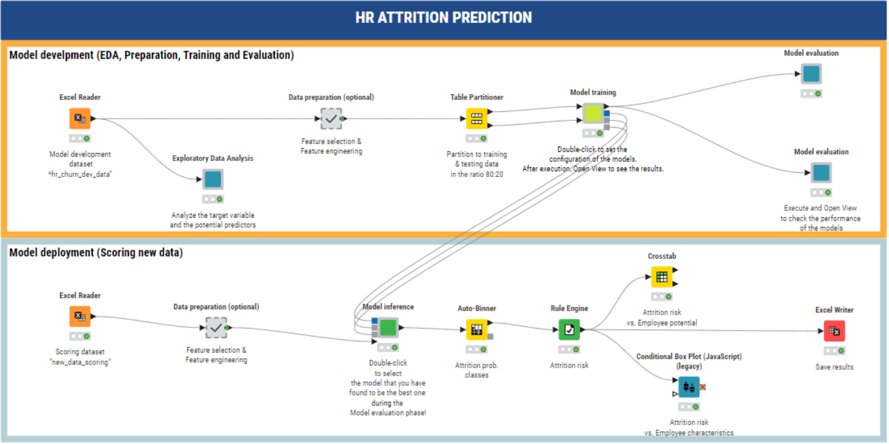

## Exploratory Data Analysis

### Target Variable Distribution

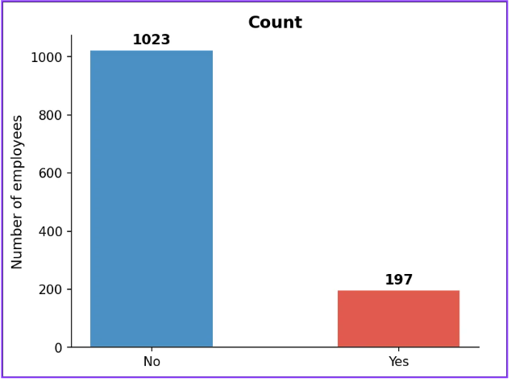

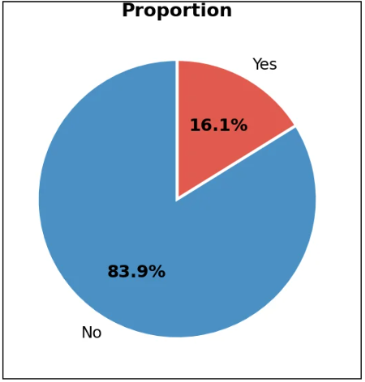

### Categorical Analysis

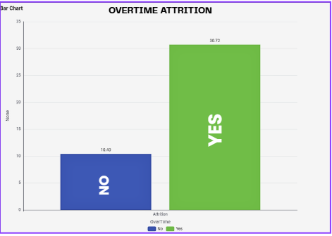

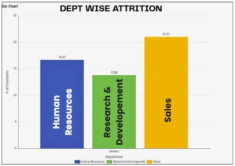

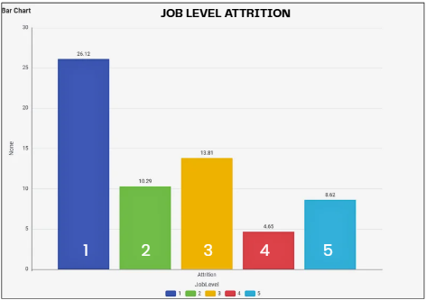

### Numeric Analysis

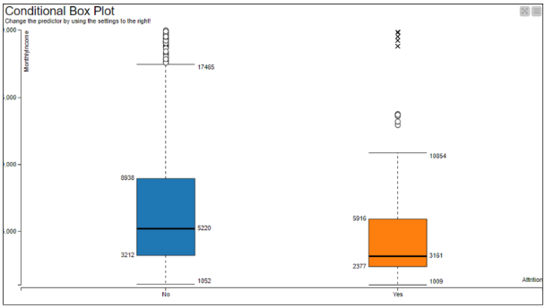

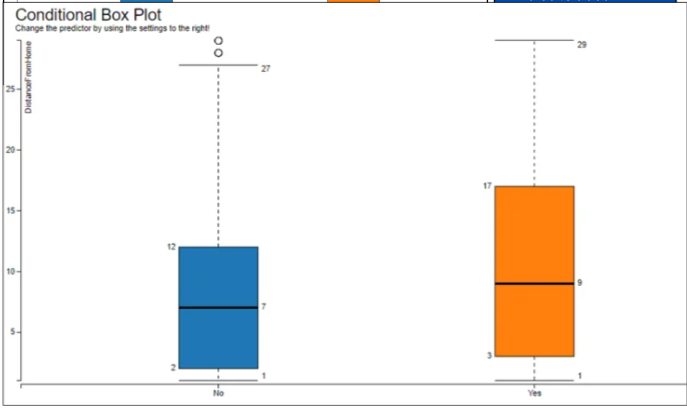

### Correlation Analysis

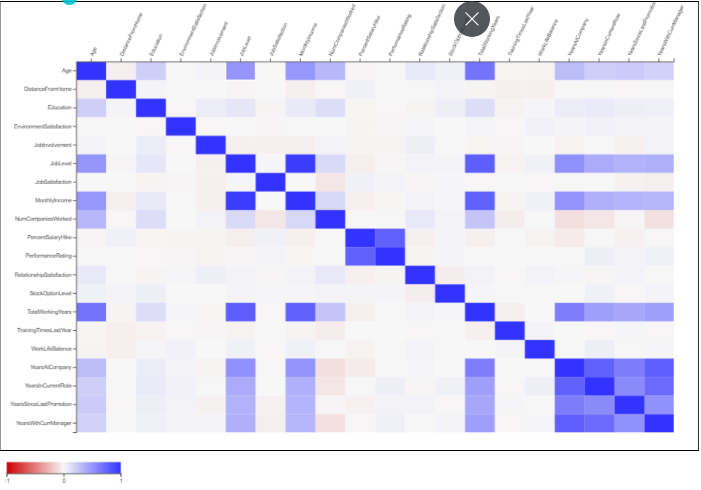

## Model Development & Evaluation

Models Compared:

- Decision Tree
- Random Forest
- Gradient Boosted Trees (GBT)

### Performance Metrics

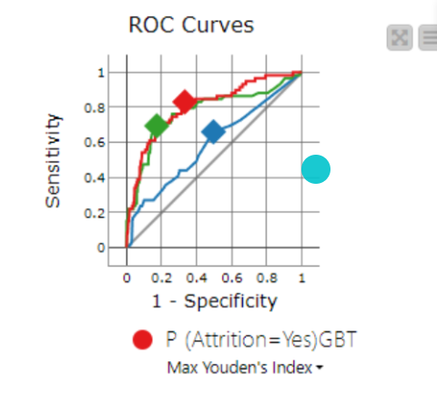

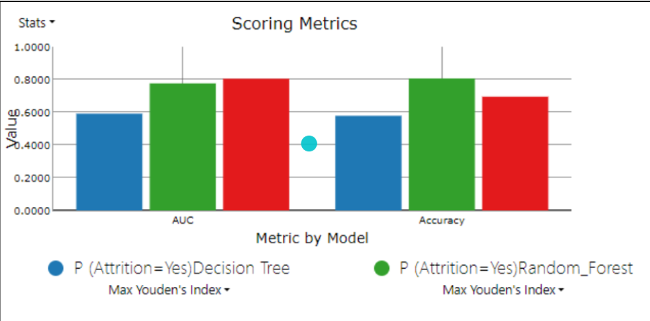

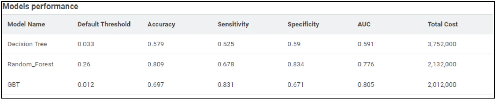

### Confusion Matrices

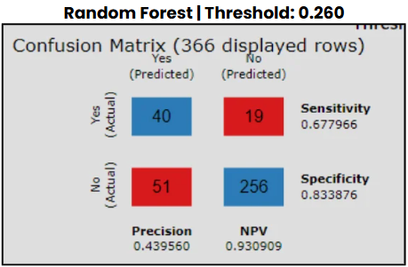

## Feature Importance

Key drivers influencing employee attrition:

- Overtime
- Stock Option Level
- Monthly Income
- Job Level
- Total Working Years

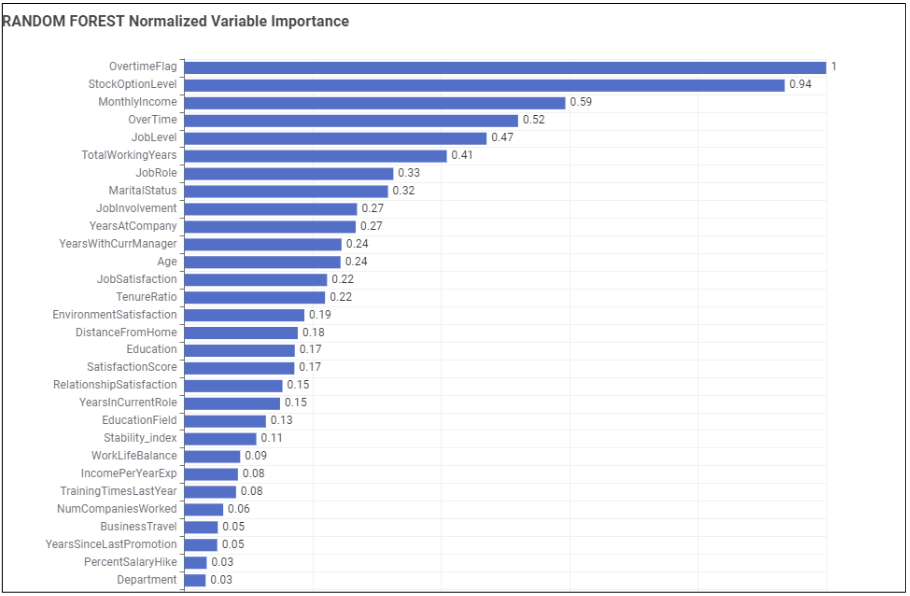

## Retention Strategy

Employees were segmented using:

- Attrition Risk
- Employee Potential

This enabled prioritization of retention interventions and investment allocation.

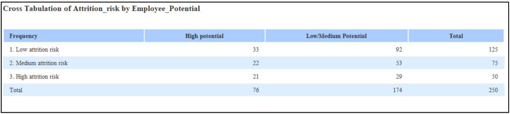

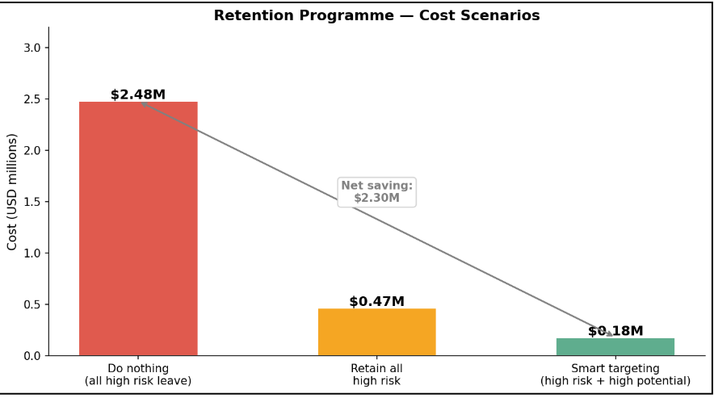

## Cost Optimization

GBT achieved the lowest misclassification cost and was selected as the final model.

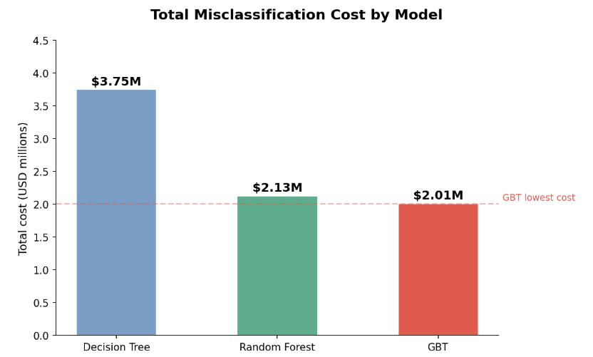

## Tools Used

- KNIME Analytics Platform
- Excel
- Classification Models
- Feature Engineering
- Predictive Analytics

- ## Repository Structure

workflow/
presentation/
screenshots/
data/
outputs/

